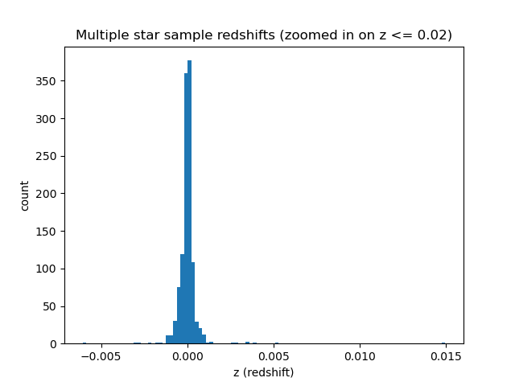
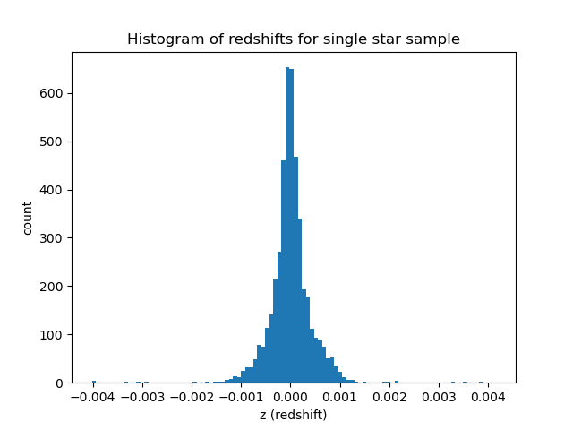
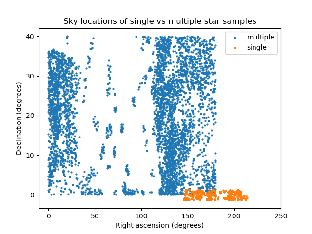
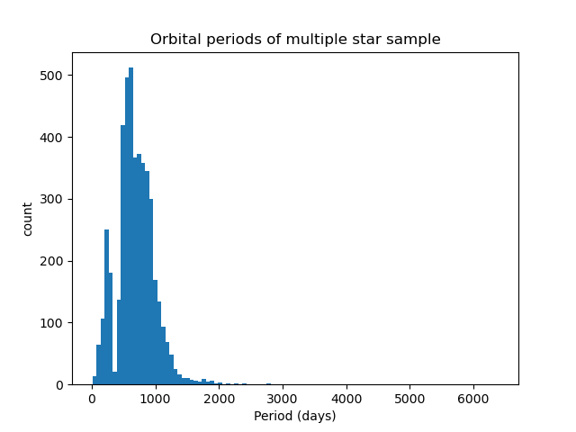
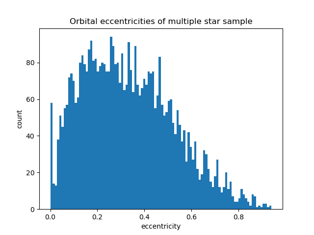
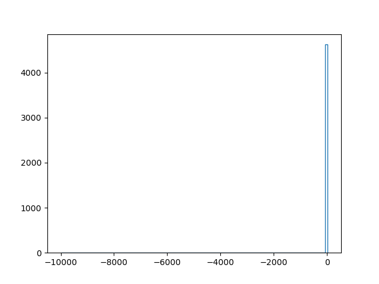

# Exploration of Binary and Single Star Overlap in the Gaia DR3 and SDSS DR18 datasets

### Contributors
- Erika Fetyko
- Rosie Jeon

## Summary
In our project, we aim to compare features of single stars vs stars in multiple star systems using features such as age, mass, color, temperature, and location on sky. Researching this question will help us understand any broad trends in how these stellar populations are different (and, if they don't differ significantly, that's important information as well). 

We will be using data from the Gaia mission (https://gea.esac.esa.int/archive/) and the Sloan Digital Sky Survey (https://www.sdss4.org/dr18/data_access/tools/). 

What are the major differences between single stars and multiple-star systems in the Milky Way? How do these populations differ in source magnitude and location on sky?

## Data profile
Our first source is data from the Gaia mission's Data Release 3. The Gaia mission was a space observatory that gathered data on about 1 billion objects, aiming to create the "largest and most precise 3D space catalog ever made". Analysis on Gaia's data continues, with a Data Release 4 planned for later this year. We use the Gaia Archive to access the data. The 

Our second source is data from the Sloan Digital Sky Survey Data Release 18. SDSS focuses on photometric data from over 1 billion objects and spectroscopic data from over 4 million objects. We use SkyServer to access the data and CasJobs to query it. DR18 is organized into three main categories: Imaging data, Spectroscopic data, and meta data. Each observed object has a number of characteristics associated with each object, including location in space (right ascension and declination), magnitudes in different color bands (such as u, g, r, i, and z), redshifts, and targeting metadata. Each object is given its unique object identifier stored as a Bigint. 

Our project consists of four datasets: Gaia multiple stars, SDSS multiples matched from Gaia, SDSS single stars, and Gaia single stars matched from SDSS. We combine these datasets to compare star features and cross-reference information (for instance, if certain data for a star is not available in Gaia, it might be available in SDSS). Our integration variable is specific sources (individual stars) that are available in both datasets. Since the datasets use different unique IDs for each source, we can’t match IDs directly; instead, we search a small patch of sky in which matches might be found. More information is available in the Reproducing section later in this report.

## Data quality and cleaning
Code for data exploration and cleaning can be found in `project_code.ipynb`, a sort of stream-of-consciousness look at the process. Additionally, please see `versions.md` for Python package information.

We found that a substantial number of observations in the Gaia data were exact matches positionally in the sky; even though the objects had different IDs, their sky coordinates were exactly the same. These could be multiple observations of the same object, or multiple objects extremely close together on the sky. Either way, we chose to drop objects with duplicate sets of coordinates, since we only need one set to run the search in SDSS.

We found that some rows in the Gaia data had null values for sky coordinates, making those observations useless for our purposes. Cleaning was necessary to drop those rows.


## Findings
Code for data analysis and findings can be found in `project_code.ipynb`. The figures are already made, so none of the code should have to be re-run.












## Future work

In the future we would like to expand the range of our search to beyond the milky way galaxy to see if these trends continue for stars outside of our galaxy 

## Challenges
The size of the datasets was a processing challenge, with several millions of rows to parse through (luckily done through SQL queries, only bringing in Python after successful queries). Though, one particularly poor query ran for 35 minutes and returned seven million rows, only stopping there because it maxed out the available storage space on CasJobs. 

We tried many times to successfully match Gaia and SDSS data before getting the right query with help from one of the TAs. There was a lot of difficulty with correctly structuring SQL to read input data correctly and restrict the search accordingly.

The datasets don’t completely overlap (the two surveys do not explore the exact same areas of the sky), so many attempts to match resulted in little to no overlap; in other words, no SDSS/Gaia object was near enough to the coordinates of a given input Gaia/SDSS object to be recognized and selected. We attempted searches with progressively higher numbers of input objects until gaining a satisfactory match sample size.


## Reproducing
Follow these steps to acquire data and reproduce our work. All named files can be downloaded from this process or from the data directory in our Github repository.


First, we query for multiple-star data.

Navigate to https://gea.esac.esa.int/archive/ and create an account if desired (allows for saved query history and for query results to be saved as user tables). Click the “Search” tab, then the “Advanced (ADQL)” tab. Enter the following query:
```
SELECT TOP 25000 * FROM gaiadr3.nss_two_body_orbit
```
This query simply selects some observations from the nss_two_body_orbit table. This table contains “non-single-star orbital models for sources compatible with an orbital two-body solution”, per the Gaia archive. 

Download the output as a VOTable named “gaia_double_stars.vot”. Run `[MAKE GAIA NONULL SCRIPT ITS REALLY SHORT].py` to clean null rows and select our chosen important columns. The output should be a CSV named “gaia2.csv”. 

Navigate to https://skyserver.sdss.org/CasJobs/SubmitJob.aspx and create an account. Click the “MyDB” tab and upload gaia2.csv as a user table titled gaia2. Click the “Query” tab and ensure DR18 is selected in the “Context” dropdown. Enter the following query:
```
SELECT specObjID, z, s.ra, s.dec, type, dered_u, dered_g, dered_r, dered_i, dered_z from SpecPhotoAll s
 JOIN mydb.gaia2 g ON s.ra BETWEEN g.ra - g.ra_error AND g.ra + g.ra_error AND s.dec BETWEEN g.dec - g.dec_error AND g.dec + g.dec_error
```
This query looks at the Gaia observations’ sky coordinates (ra, dec) and their associated error values (ra_error, dec_error) to effectively make a square of sky where the given object most likely is located. The query then applies these sky squares to the DR18 database, finding objects in the SDSS catalog located within the squares. 

The results of this query will show up in MyDB as a table. Save this table as a CSV named “sdss_binary_match.csv”. 


Next, we look at single-star data.


Run `[MAKE CLEAN INTEGRATION SCRIPT].py` to find the closest matches for each class of star system (single or multiple).

Analysis / visualizations are available in `project_code.ipynb`.


## References/Acknowledgments 


The data set does not have explicit license listed anywhere on the website, but they do provide citations to properly cite the data implying that it falls under either CC-BY or CC-BY-SA. There is also a web page on the website citing image reproduction explicitly stating that all images on the SDSS.org website fall under CC-BY. With the images explicitly labeled as CC-BY and the data set given an acknowledgement we can not be certain our usage falls within the license the data is under, but we can assume that we are. 

Funding for the DPAC has been provided by national institutions, in particular the institutions participating in the Gaia Multilateral Agreement. The Gaia Data set is open and free to use as long as credit is given to ESA/Gaia/DPAC. Additional terms and conditions include not being liable for and reproduction of the data on other websites along with any potential falsehoods presented by that other website and does not accept any liability in any damages created by misrepresentations of the data or the website. The usage license for the Gaia Project was easy to find, as they have a clear page on how to cite all of the data releases individually. 

Gaia acknowledgment // This work has made use of data from the European Space Agency (ESA) mission Gaia (https://www.cosmos.esa.int/gaia), processed by the Gaia Data Processing and Analysis Consortium (DPAC, https://www.cosmos.esa.int/web/gaia/dpac/consortium). Funding for the DPAC has been provided by national institutions, in particular the institutions participating in the Gaia Multilateral Agreement. //

SDSS acknowledgment // Funding for the Sloan Digital Sky Survey V has been provided by the Alfred P. Sloan Foundation, the Heising-Simons Foundation, the National Science Foundation, and the Participating Institutions. SDSS acknowledges support and resources from the Center for High-Performance Computing at the University of Utah. SDSS telescopes are located at Apache Point Observatory, funded by the Astrophysical Research Consortium and operated by New Mexico State University, and at Las Campanas Observatory, operated by the Carnegie Institution for Science. The SDSS web site is www.sdss.org. 
SDSS is managed by the Astrophysical Research Consortium for the Participating Institutions of the SDSS Collaboration, including the Carnegie Institution for Science, Chilean National Time Allocation Committee (CNTAC) ratified researchers, Caltech, the Gotham Participation Group, Harvard University, Heidelberg University, The Flatiron Institute,  The Johns Hopkins University, L’Ecole polytechnique fédérale de Lausanne (EPFL), Leibniz-Institut für Astrophysik Potsdam (AIP), Max-Planck-Institut für Astronomie (MPIA Heidelberg), Max-Planck-Institut für Extraterrestrische Physik (MPE), Nanjing University, National Astronomical Observatories of China (NAOC), New Mexico State University, The Ohio State University, Pennsylvania State University, Smithsonian Astrophysical Observatory, Space Telescope Science Institute (STScI), the Stellar Astrophysics Participation Group, Universidad Nacional Autónoma de México (UNAM), University of Arizona, University of Colorado Boulder, University of Illinois at Urbana-Champaign, University of Toronto, University of Utah, University of Virginia, Yale University, and Yunnan University.  //


Babusiaux et al. (2023) 
Bowen & Vaughan (1973)
Gaia Collaboration et al. (2016b)
Gaia Collaboration et al. (2023e): 
Gaia Collaboration et al. (2023j)
Gunn et al. (2006), 
I. S. Bowen and A. H. Vaughan, (1973) 
Kollmeier et al. (2025). 
Smee et al. (2013)
Wilson et al. (2019)


Python 3.11.9
Astropy 7.2.0
matplotlib 3.10.8
pandas 3.0.2
numpy 2.4.4

https://gea.esac.esa.int/archive/ // website for querying gaia data

https://skyserver.sdss.org/CasJobs/SubmitJob.aspx // website for querying sdss data

https://www.sdss3.org/dr9/ // for dr9 sky coverage (couldn’t find same for dr18 so went off this for querying)

https://en.wikipedia.org/wiki/Gaia_(spacecraft) 

https://en.wikipedia.org/wiki/Sloan_Digital_Sky_Survey 

https://www.sdss.org/dr18/mwm/about/ 


